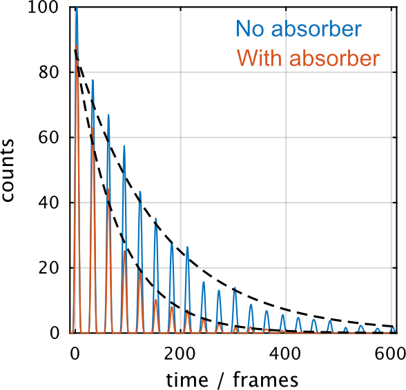
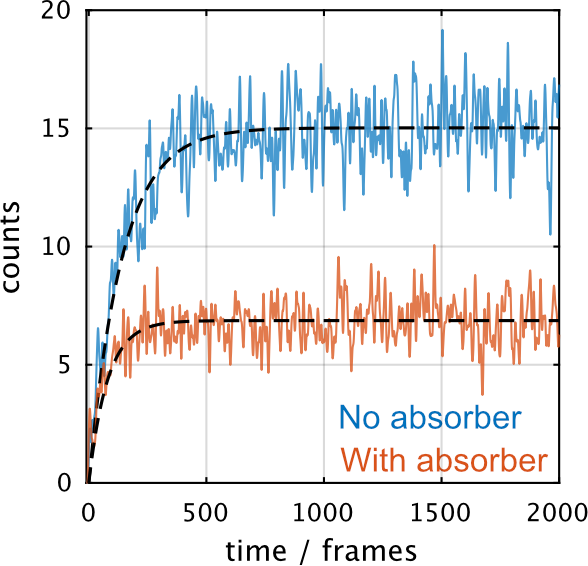

# ceas-processing
Simple demonstration of concepts of Cavity Enhanced Spectroscopy. Written in Processing 3.

## Installation

- Download [Processing](https://processing.org)
- Run `.ceas/ceas.pde`

You can also compile the whole sketch into an executable with Processing: `File -> Export Application...`

## Controls

- __[esape]__ - quit
- __[backspace]__ - reset (stop all recording and despawn everything)
- __[spacebar]__ - spawn single burst of photons
- __[up/down]__ - increase/decrease spawn rate
- __[left/right]__ - increase/decrease speed of light
- __[T]__ - toggle continuos spawn
- __[S]__ - spawn a source of photons
- __[L]__ - show item labels
- __[R]__ - toggle record form the detectors

## Analysis

Analysis scripts written in Matlab. Data recorded from the detectors in the demonstration.

CRDS measures the lifetime of light inside of the cavity:

CEAS measures the changes in the steady-state of light in the cavity:

## ToDo's

- More general collision detection? 
- Curved mirrors
- Show the requirement for the cavity stability criterion
- Evanescent wave cavities (This would require coding in a separate behavior for the photons when they are in the evanescent wave, and will probably be non-trivial)
